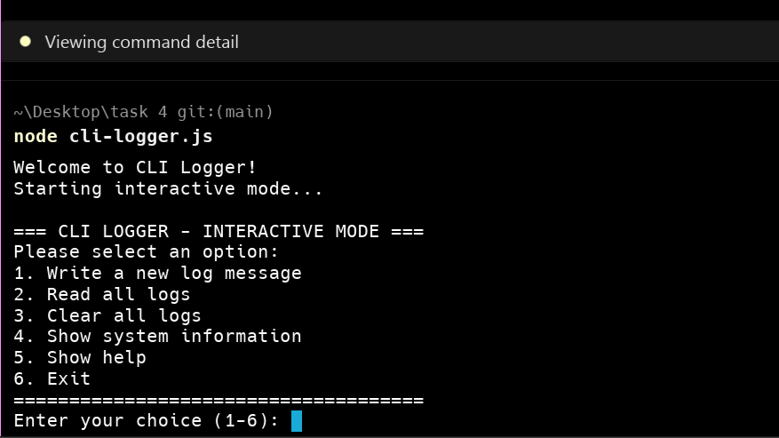

# CLI Logger Tool

A Node.js command-line interface (CLI) tool for managing logs with write, read, and clear operations. This project demonstrates the use of `process.argv` for command-line argument parsing, `readline` for interactive input, and various Node.js modules for file operations and system information.

## Features

- **Interactive Menu System**: User-friendly numbered menu (1-6) for easy navigation
- **Write Logs**: Add timestamped messages to a log file
- **Read Logs**: Display all logs from the file
- **Clear Logs**: Remove all logs from the file with confirmation
- **System Information**: Display system details like memory, CPU, and platform
- **Direct Commands**: Support for both interactive and direct command execution
- **Operation Logging**: All operations are logged to a separate file for audit purposes
- **Error Handling**: Comprehensive error handling and user feedback

## Installation

1. Clone this repository:
   ```bash
   git clone https://github.com/ahmedwaleed2002/tasksf4.git
   cd task-4
   ```

2. Make sure you have Node.js installed on your system

3. The tool is ready to use! No additional dependencies required.

## Interactive Menu System

The CLI Logger features an intuitive interactive menu system that launches by default when you run the tool without arguments. This provides a user-friendly interface where you can select operations by pressing numbers 1-6.

### Menu Options:

```
=== CLI LOGGER - INTERACTIVE MODE ===
Please select an option:
1. Write a new log message
2. Read all logs
3. Clear all logs
4. Show system information
5. Show help
6. Exit
=====================================
```

### How to Use Interactive Mode:

1. **Start Interactive Mode**: Simply run `node cli-logger.js` (no arguments)
2. **Select Operation**: Press a number (1-6) and hit Enter
3. **Follow Prompts**: The tool will guide you through each operation
4. **Continue or Exit**: After each operation, choose to continue or exit

### Interactive Features:

- **Smart Prompts**: Context-aware prompts for each operation
- **Confirmation Dialogs**: Safety confirmations for destructive operations (like clear)
- **Error Validation**: Input validation with helpful error messages
- **Smooth Flow**: Seamless transitions between operations
- **Clean Exit**: Proper cleanup and graceful exit

## Usage

### Basic Commands

```bash
# Write a log message
node cli-logger.js write "This is my first log message"

# Read all logs
node cli-logger.js read

# Clear all logs
node cli-logger.js clear

# Show system information
node cli-logger.js info

# Show help
node cli-logger.js help
```

### Interactive Mode

If you run the write command without a message, it will start interactive mode:

```bash
node cli-logger.js write
# This will prompt you to enter a message
```

### Examples

```bash
# Example 1: Write a log
$ node cli-logger.js write "Application started successfully"
Log written successfully!

# Example 2: Write another log
$ node cli-logger.js write "User logged in with ID: 12345"
Log written successfully!

# Example 3: Read logs
$ node cli-logger.js read

--- LOG CONTENTS ---
[2024-01-15T10:30:45.123Z] Application started successfully
[2024-01-15T10:31:12.456Z] User logged in with ID: 12345
--- END OF LOGS ---

# Example 4: System information
$ node cli-logger.js info

--- SYSTEM INFORMATION ---
Platform: win32
Hostname: MyComputer
Total Memory: 16384.00 MB
Free Memory: 8192.00 MB
CPU Cores: 8
System Uptime: 2.5 hours
--- END SYSTEM INFO ---

# Example 5: Clear logs
$ node cli-logger.js clear
Logs cleared successfully!
```

## Day 4 Learning Objectives

This project was built as part of Day 4 of a Node.js learning curriculum, focusing on:

### 1. User Input via process.argv

**What We Learned:**
- `process.argv` is an array containing command-line arguments
- `process.argv[0]` is the Node.js executable path
- `process.argv[1]` is the script file path
- `process.argv.slice(2)` gets the actual command-line arguments

**Implementation:**
```javascript
function main() {
    const args = process.argv.slice(2);  // Get command-line arguments
    
    if (args.length === 0) {
        showInteractiveMenu();  // No args = interactive mode
        return;
    }
    
    const command = args[0].toLowerCase();
    
    switch (command) {
        case 'write':
            if (args.length > 1) {
                const message = args.slice(1).join(' ');  // Join multiple words
                writeLog(message);
            }
            break;
        // ... other commands
    }
}
```

### 2. Interactive Input with readline

**What We Learned:**
- `readline` module provides interface for reading input line by line
- Must create interface with `input` and `output` streams
- Always close the interface to prevent memory leaks
- Handle asynchronous input with callbacks

**Implementation:**
```javascript
function showInteractiveMenu() {
    const rl = readline.createInterface({
        input: process.stdin,
        output: process.stdout
    });
    
    rl.question('Enter your choice (1-6): ', (choice) => {
        handleMenuChoice(choice.trim(), rl);
    });
}

function handleMenuChoice(choice, rl) {
    switch (choice) {
        case '1':
            rl.question('Enter your log message: ', (message) => {
                rl.close();  // Always close the interface
                writeLog(message);
            });
            break;
        // ... other cases
    }
}
```

### 3. Command-based CLI Tools

**What We Learned:**
- CLI tools can support both direct commands and interactive modes
- User experience is crucial for CLI applications
- Error handling and validation improve usability
- Proper flow control prevents interface conflicts

**Implementation Features:**
- **Dual Mode Operation**: Direct commands (`node cli-logger.js write "message"`) and interactive menu
- **Menu-driven Interface**: Numbered options (1-6) for easy selection
- **Flow Control**: Proper handling of sequential readline operations
- **Error Handling**: Validation and user-friendly error messages
- **Confirmation Dialogs**: Safety prompts for destructive operations

## Technical Implementation

### Core Node.js Modules Used

1. **process.argv**: Command-line argument parsing
   ```javascript
   const args = process.argv.slice(2);
   const command = args[0].toLowerCase();
   ```

2. **readline**: Interactive user input
   ```javascript
   const rl = readline.createInterface({
       input: process.stdin,
       output: process.stdout
   });
   ```

3. **fs module**: File operations (read, write, append)
   ```javascript
   fs.appendFile(LOGS_FILE, logEntry, callback);
   fs.readFile(LOGS_FILE, 'utf8', callback);
   ```

4. **path module**: Cross-platform file path handling
   ```javascript
   const LOGS_FILE = path.join(__dirname, 'logs.txt');
   ```

5. **os module**: System information retrieval
   ```javascript
   const totalMemory = os.totalmem();
   const platform = os.platform();
   ```

### File Structure

```
task-4/
├── cli-logger.js          # Main CLI tool
├── logs.txt               # User logs (created automatically)
├── operationLogs.txt      # Operation audit log (created automatically)
├── package.json           # Node.js project configuration
└── README.md             # This file
```

### Commands Breakdown

| Command | Description | Example |
|---------|-------------|---------|
| `write <message>` | Writes a timestamped message to logs.txt | `node cli-logger.js write "Hello World"` |
| `write` | Interactive mode - prompts for message | `node cli-logger.js write` |
| `read` | Displays all logs from logs.txt | `node cli-logger.js read` |
| `clear` | Clears all logs from logs.txt | `node cli-logger.js clear` |
| `info` | Shows system information | `node cli-logger.js info` |
| `help` | Shows help information | `node cli-logger.js help` |

## Error Handling

The tool includes comprehensive error handling:

- **File not found**: Gracefully handles when log files don't exist
- **Empty logs**: Informs user when no logs are available
- **Invalid commands**: Provides helpful error messages for unknown commands
- **Write errors**: Handles file system errors during write operations
- **System errors**: Logs all errors to the operation log for debugging

## Operation Logging

All operations are automatically logged to `operationLogs.txt` with timestamps:

```
[2024-01-15T10:30:45.123Z] Operation: WRITE - Message: "Application started"
[2024-01-15T10:31:12.456Z] Operation: READ - Logs displayed successfully
[2024-01-15T10:32:30.789Z] Operation: CLEAR - All logs cleared
```

## Screenshots and Demonstration

The following screenshots demonstrate the CLI Logger tool in action:

### 1. Interactive Menu System
**Screenshot Name**: `interactive-menu.png`
**Description**: Shows the main interactive menu with numbered options (1-6)



**What to capture**: 
- Welcome message
- Menu options display
- User input prompt

### 2. Write Log Operation
**Screenshot Name**: `write-log-demo.png`
**Description**: Demonstrates writing a log message interactively
**What to capture**: 
- Option 1 selection
- Log message input
- Success confirmation
- Continue prompt

### 3. Read Logs Operation
**Screenshot Name**: `read-logs-demo.png`
**Description**: Shows reading and displaying log contents
**What to capture**: 
- Option 2 selection
- Log contents with timestamps
- Formatted output display

### 4. System Information Display
**Screenshot Name**: `system-info-demo.png`
**Description**: Demonstrates system information feature
**What to capture**: 
- Option 4 selection
- System details (memory, CPU, platform)
- Formatted system info output

### 5. Clear Logs with Confirmation
**Screenshot Name**: `clear-logs-demo.png`
**Description**: Shows the clear operation with safety confirmation
**What to capture**: 
- Option 3 selection
- Confirmation dialog
- Success message

### 6. Direct Command Usage
**Screenshot Name**: `direct-commands-demo.png`
**Description**: Demonstrates direct command usage (non-interactive)
**What to capture**: 
- `node cli-logger.js write "message"` command
- `node cli-logger.js read` command
- `node cli-logger.js help` command

### 7. Help System
**Screenshot Name**: `help-system-demo.png`
**Description**: Shows comprehensive help information
**What to capture**: 
- Option 5 selection or `node cli-logger.js help`
- Complete help documentation
- Usage examples

### 8. Operation Logs Audit Trail
**Screenshot Name**: `operation-logs-demo.png`
**Description**: Shows the audit trail of all operations
**What to capture**: 
- Contents of `operationLogs.txt`
- Timestamped operation entries
- Different operation types logged

## Development Notes

This CLI tool was built as part of a Node.js learning curriculum focusing on:

- **Day 4 Learning Goals**: 
  - User input via `process.argv`
  - Interactive input with `readline`
  - Building command-based CLI tools
  - Integration with file system operations
  - System information retrieval

### Previous Days Integration

- **Day 1**: Node.js architecture and event loop understanding
- **Day 2**: Module system with require/exports
- **Day 3**: File operations with fs, path, and os modules
- **Day 4**: Command-line interfaces and user input handling

### Technical Challenges and Solutions

#### Challenge 1: Readline Interface Conflicts
**Problem**: Multiple sequential readline operations caused input conflicts and interface mixing.
**Solution**: 
- Properly close each readline interface before starting the next
- Use setTimeout for proper timing between operations
- Implement clean state management

```javascript
function handleMenuChoice(choice, rl) {
    switch (choice) {
        case '1':
            rl.question('Enter your log message: ', (message) => {
                rl.close();  // Close immediately after input
                writeLog(message);
                setTimeout(() => {
                    askToContinue();  // Start new interface after delay
                }, 1000);
            });
            break;
    }
}
```

#### Challenge 2: Command-line Argument Parsing
**Problem**: Handling both single commands and multi-word messages.
**Solution**: 
- Use `process.argv.slice(2)` to get arguments
- Join remaining arguments for multi-word messages
- Implement flexible parsing logic

```javascript
if (args.length > 1) {
    const message = args.slice(1).join(' ');  // Join all words after command
    writeLog(message);
}
```

#### Challenge 3: User Experience Flow
**Problem**: Creating smooth transitions between operations.
**Solution**: 
- Implement "continue or exit" prompts
- Add confirmation dialogs for destructive operations
- Provide clear feedback for each action

```javascript
function askToContinue() {
    const rl = readline.createInterface({
        input: process.stdin,
        output: process.stdout
    });
    
    rl.question('\nWould you like to perform another operation? (y/N): ', (answer) => {
        rl.close();
        if (answer.toLowerCase() === 'y') {
            setTimeout(() => showInteractiveMenu(), 500);
        } else {
            process.exit(0);
        }
    });
}
```

## Contributing

1. Fork the repository
2. Create a feature branch
3. Make your changes
4. Test thoroughly
5. Submit a pull request

## License

This project is licensed under the ISC License.

## Author

Created by Ahmed Waleed Bin Yunus (C) - Day 4 Task.
